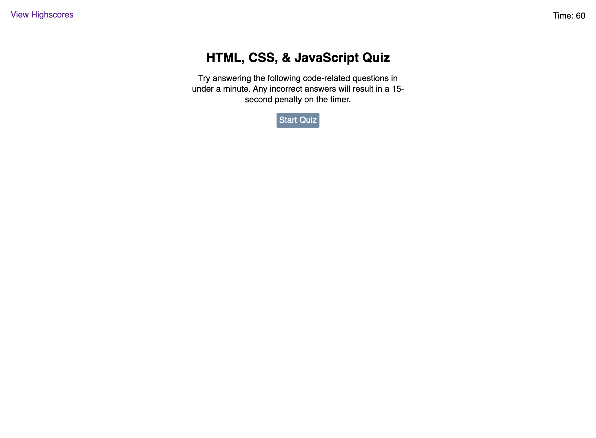

# Code Quiz ⏲️

## Description

A quiz designed for coders who would like to put their knowledge of HTML, CSS, and Javascript to the test. This quiz contains five multiple choice questions and must be completed in 60 seconds or less. A score is calculated based on how much time is left and how many questions were answered correctly. Your score is saved at the end with your provided initials and added to the highscore score board.

## Screenshot

## Link

https://kelseybrianne.github.io/code-quiz/